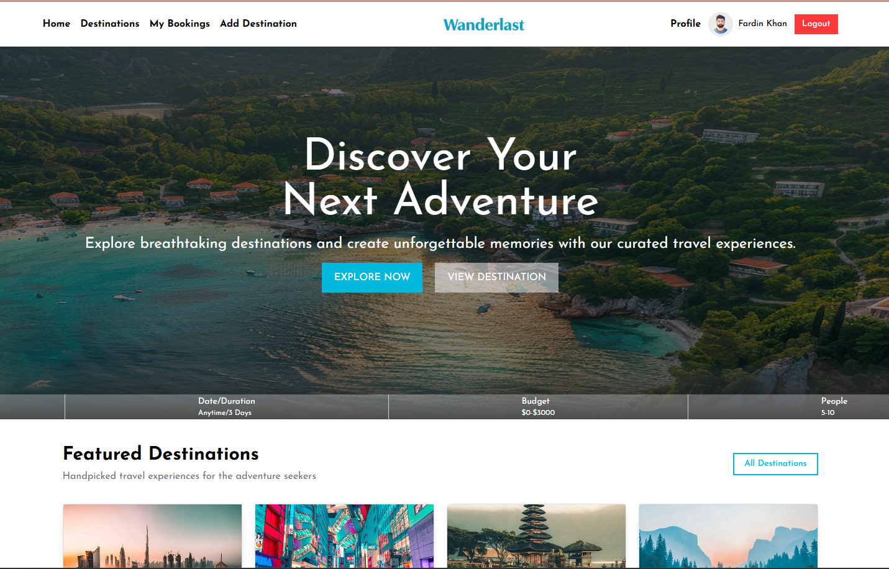

# 🌍 Wanderlust — Travel Booking Platform

Wanderlust is a modern full-stack travel booking platform where users can explore destinations, view detailed travel packages, and book their dream trips seamlessly.

Built with a clean UI, secure authentication, and responsive design, Wanderlust delivers a smooth travel booking experience across all devices.

---

## ✨ Features

### 🔐 Authentication
- User registration & login
- Secure authentication system
- Protected booking routes
- JWT-based authorization

### 🧳 Destination Management
- Browse featured destinations
- View detailed destination information
- Add new destinations
- Edit & delete destinations

### 📅 Booking System
- Book travel destinations
- Select departure dates
- Personalized booking history
- Secure booking requests

### 🎨 Modern UI/UX
- Fully responsive design
- Mobile-friendly navigation
- Beautiful destination cards
- Smooth hover & transition effects

### 👤 User Features
- User profile section
- Avatar support
- Personalized experience

---

# 🛠️ Tech Stack

## Frontend
- Next.js 15
- React
- Tailwind CSS
- HeroUI
- React Icons
- React Hot Toast

## Backend
- Node.js
- Express.js
- MongoDB

## Authentication
- Better Auth / JWT Authentication

---

# 📂 Project Structure

```bash
wanderlust/
│
├── client/
│   ├── app/
│   ├── components/
│   ├── lib/
│   └── public/
│
├── server/
│   ├── routes/
│   ├── middleware/
│   ├── controllers/
│   └── database/
│
└── README.md
```

---

# ⚙️ Installation & Setup

## 1️⃣ Clone the Repository

```bash
git clone https://github.com/your-username/wanderlust.git
```

---

## 2️⃣ Install Frontend Dependencies

```bash
cd client
npm install
```

---

## 3️⃣ Install Backend Dependencies

```bash
cd ../server
npm install
```

---

# 🔑 Environment Variables

Create a `.env.local` file inside the client:

```env
NEXT_PUBLIC_SERVER_URL=http://localhost:5000
```

Create a `.env` file inside the server:

```env
PORT=5000
MONGO_DB_URI=your_mongodb_uri
JWT_SECRET=your_secret_key
```

---

# ▶️ Run the Project

## Frontend

```bash
npm run dev
```

## Backend

```bash
nodemon index.js
```

---

# 📱 Responsive Design

Wanderlust is optimized for:

- Desktop 💻
- Tablet 📱
- Mobile 📲

---

# 🔒 Security Features

- JWT Authorization
- Protected API Routes
- Token Verification
- Secure Booking Requests

---

# 🚀 Future Improvements

- Payment Gateway Integration
- Admin Dashboard
- Travel Reviews & Ratings
- Wishlist System
- Email Notifications
- Booking Cancellation System

---

# 📸 Screenshots



---

# 🌐 Live Demo

Frontend:  
`https://wanderlust-five-mauve.vercel.app/`

Backend:  
`https://wanderlust-server-o8pi.onrender.com`

---

# 👨‍💻 Author

### Md Sakibur Rahman

Passionate MERN Stack Developer focused on building modern and scalable web applications.

---

# ⭐ Support

If you like this project, give it a ⭐ on GitHub and share your feedback.

---

# 📄 License

This project is licensed under the MIT License.